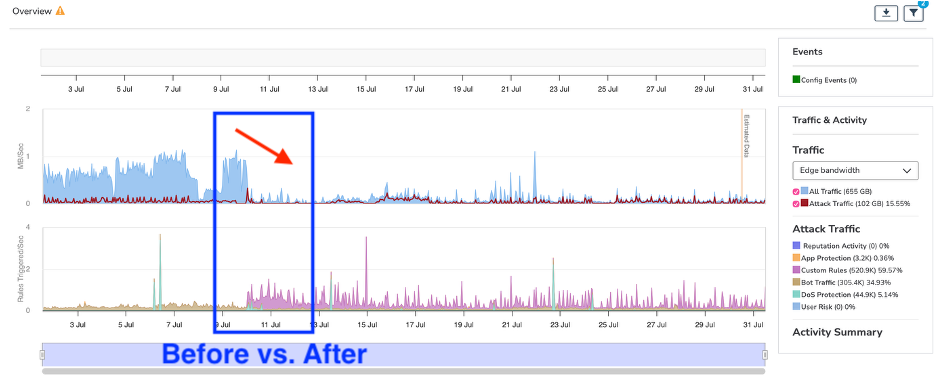

## English

### Solution Mindset
When WAF/CDN edge logs, origin logs, and stakeholder observations disagree, the real challenge is not the sheer volume of data, but the tendency of different parties to jump to conclusions based on partial signals. My primary task is to convert these fragmented signals into objective, verifiable facts with clear testing baselines and accountability.

I first align timestamps and request signatures to determine the interpretation limits of each dataset. Then, I separate verified facts from blind spots, stratifying suspicious behaviors, existing controls, and next steps to establish a shared baseline that the entire team can read and agree upon.

### Field Cases

#### 01. Anomalous Behavior & WebShell Investigation
During an investigation of anomalous traffic on an enterprise's employee report upload system, the protection platform triggered alerts. However, application logs showed legitimate user logins with no obvious anomalies, leading users to suspect a WebShell attack. Instead of rushing to tune blocking rules based on a single platform's alert, I meticulously aligned the WAF edge logs and origin server logs by timestamp and signature. Ultimately, I pinpointed the suspected WebShell file write path, distinctly separating it from historical application behavior. By identifying the user's client fingerprint details to increase confidence, I packaged the investigation into an actionable report with recommended practices. The deliverable provided a traceable factual basis, precise access control recommendations, and clear monitoring directions, successfully blocking subsequent malicious attempts.

#### 02. Automated Download Abuse Mitigation
In a severe automated download abuse scenario on a manufacturing website, the attack vectors were stealthy. Malicious sources rapidly rotated IPs to evade firewall and application anomaly rules. Built-in protection rules couldn't distinguish between malicious bots and normal users, rendering standard rate limiting ineffective. I conducted a deep analysis of traffic behavior and TLS/JA4 fingerprint signatures. Starting from simulated download behaviors on the app and user ends, as well as the target objects, I redesigned the defense logic. I implemented a layered, distributed filtering approach based on paths, request sources, and frequencies. While preserving normal business traffic with zero false positives, this method successfully mitigated approximately 85% of malicious automated abuse.

*De-identified supporting artifact. Client names, identifiers, and confidential configuration details have been removed.*

## 中文

### 解決方案思維
當 WAF/CDN 邊緣防護紀錄、伺服器原站日誌 (Origin Logs) 與各方觀察彼此不一致時，真正的挑戰不在於資料龐雜，而是各方往往基於片面訊號驟下結論。我的首要任務，是將這些模糊零碎的訊號轉化為具備測試基準、可驗收，且責任分明的客觀事實。

我會先對齊時間戳記與請求特徵，確認每份資料的解讀極限。接著區分已確認事實與待驗證盲區，將可疑行為、既有控制措施與下一步行動進行分層收斂，建立團隊能共同判讀的基準線。

### 實務案例

#### 01. 異常行為與 WebShell 調查
在一次企業網站的員工報表上傳系統異常流量排查中，防護平台跳出異常告警，且應用端日誌由於是合法使用者登入，但卻未見明顯異常，使用者懷疑站台遭到 Web shell 攻擊，我沒有急於依據單一平台的告警下定論而直接進行阻擋規則調教，而是將 WAF 邊緣防護紀錄與伺服器原站日誌進行逐筆時間戳與特徵對齊。最終精準定位出疑似 WebShell 的檔案寫入路徑，並將其與既有的歷史應用行為明確區隔，定位出使用者的指紋端詳細資訊以增加判讀信心後，將事件調查整理成一份報告並帶有建議做法交給使用者。交付成果是可回溯的事實依據、精確的存取控制建議與監控方向，有效阻擋了後續的惡意嘗試。

#### 02. 自動化下載濫用緩解
在製造業網站面臨嚴重的自動化下載濫用情境中，由於攻擊手法隱蔽，惡意來源透過 IP 快速輪換的方式閃避防火牆與站台應用程式異常規則觸發告警。內建的防護規則無法有效辨識惡意機器人與正常使用者，導致常規的頻率限制 (Rate Limiting) 無法發揮作用。我透過深度分析流量行為與 TLS/JA4 指紋特徵，並且以 APP端、使用者端模擬下載行為以及標的物為出發點，重新設計了防護邏輯，將規則以路徑、請求來源以及頻率的方式分層分散執行過濾。在保留正常業務流量、零誤殺的前提下，成功緩解了約 85% 的惡意自動化濫用行為。

*去識別化佐證圖；已移除客戶名稱、識別資訊與機密設定細節。*
