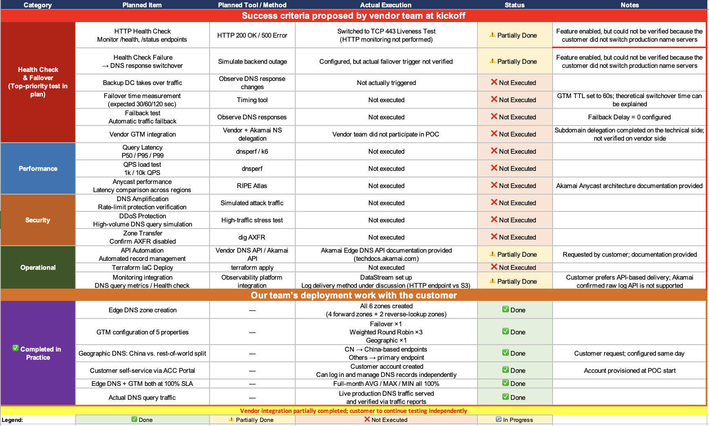

## English

### Solution Mindset
Technical Proof of Concept (POC) stalls often stem from scope, network environments, test conditions, and acceptance criteria being scattered across different conversations. My delivery principle is absolute clarity: ensuring that even a successor with "zero context" can understand at a glance what the current gaps are, who is responsible, and the exact acceptance criteria, thereby keeping the project moving forward.

I break down technical delivery into pre-launch confirmation, scope and test conditions, dependencies and ownership (RACI), progress tracking, closure evidence, and follow-ups. By establishing a Work Breakdown Structure (WBS) and clear communication protocols, I expose ambiguous expectations and precisely resolve delivery bottlenecks.

### Field Cases

#### 01. Enterprise Security Validation Delivery System
Past technical validations frequently faced delays, primarily because critical deployment prerequisites—such as firewall allowances and test accounts—were only discovered missing after technical work "claimed to have started," leading to endless rework. Over the past 12 months, I led 30+ technical validations spanning Web/API Security, Bot Defense, DNS/Traffic Management, and Zero Trust. I completely restructured easily misunderstood request information into concrete deployment prerequisites and delivery checkpoints. This ensured network access and expected outcomes were confirmed before technical work began, drastically reducing delivery friction.

#### 02. Phased Implementation Planning for Large-Scale Projects
While leading a large-scale enterprise DNS architecture validation involving multiple technical dependencies, the project stalled: the engineering team was stuck on unclear test conditions, and critical responsibilities were scattered across conversations with other vendors and internal teams. I immediately halted the ineffective technical divergence. Rethinking from the customer's perspective, I prepared technical selection and handoff assets while simultaneously defining our implementation records and technical boundaries. I developed a phased implementation plan (covering deployment content and expected benefits) alongside 10 key checkpoints for this validation, materializing deployment assumptions and acceptance criteria. This clear handoff asset ensured that a "zero context" successor could strictly follow the plan, achieving a seamless transition.

*De-identified supporting artifact. Client names, identifiers, and confidential configuration details have been removed.*

## 中文

### 解決方案思維
技術驗證 (POC) 的停滯，往往肇因於範疇、網路環境、測試條件及驗收標準散落於各方溝通中。我的交付原則是：確保「零脈絡」的接手者也能一目了然——目前的缺口為何、責任歸屬，以及具體的驗收標準，讓專案順利推進。

我將技術交付拆解為啟動前確認、範疇與測試條件、相依性與所有權 (RACI)、進度追蹤、結案依據與後續事項。透過建立工作分解結構 (WBS) 與明確的通訊協定，將模糊的期待攤開，精準處理交付瓶頸。

### 實務案例

#### 01. 企業資安驗證交付系統
過去的技術驗證經常面臨延宕，主因是防火牆放行、測試帳號等關鍵部署前提，往往在技術工作「宣稱啟動」後才被發現付之闕如，導致不斷重工。近十二個月內，我主責 30+ 件涵蓋 Web／API Security、Bot Defense、DNS／Traffic Management 與 Zero Trust 的技術驗證。我將易生誤解的申請資訊，徹底重整為部署前提與交付檢查點，確保網路放行與預期結果能在技術工作啟動前即確認完畢，大幅降低了交付摩擦。

#### 02. 大型專案分階段導入規劃
在主導一項跨越多方技術依賴的大型企業 DNS 架構驗證時，專案一度陷入停滯：工程團隊卡在測試條件不明確，且關鍵責任全散落在其他供應商與內部團隊的對話中。我立刻要求暫停無效的技術發散，以客戶視角重新準備技術評選與交接資產，同時預備我方的施工紀錄表與技術邊界劃分。我針對該驗證制定了分階段的導入計畫（涵蓋部署內容、預期效益）與十項關鍵查核點，將部署假設與驗收標準具象化。這份清晰的交接資產確保了「零脈絡」的接手者也能按表操課，實現無縫交接。

*去識別化佐證圖；已移除客戶名稱、識別資訊與機密設定細節。*
