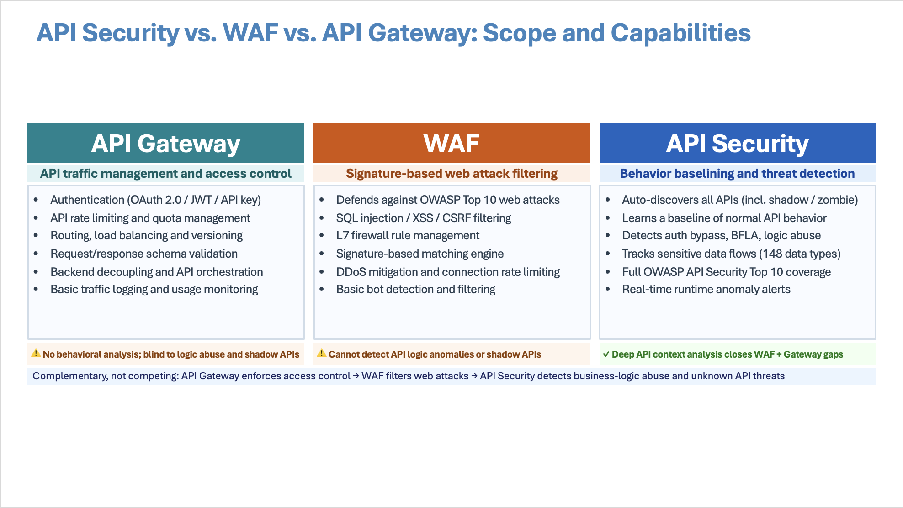
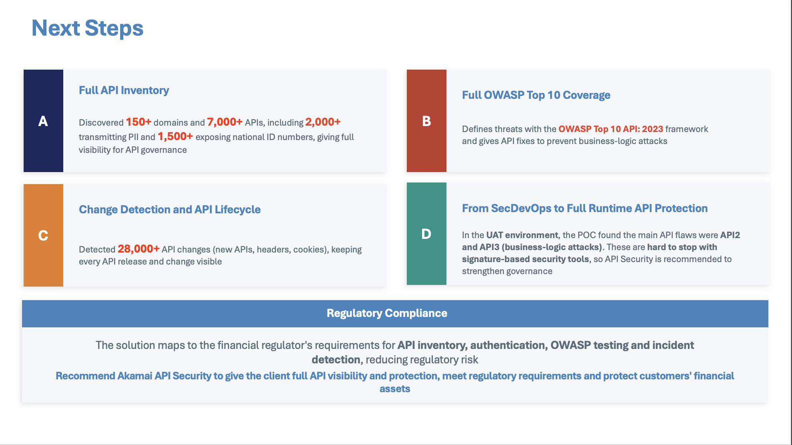
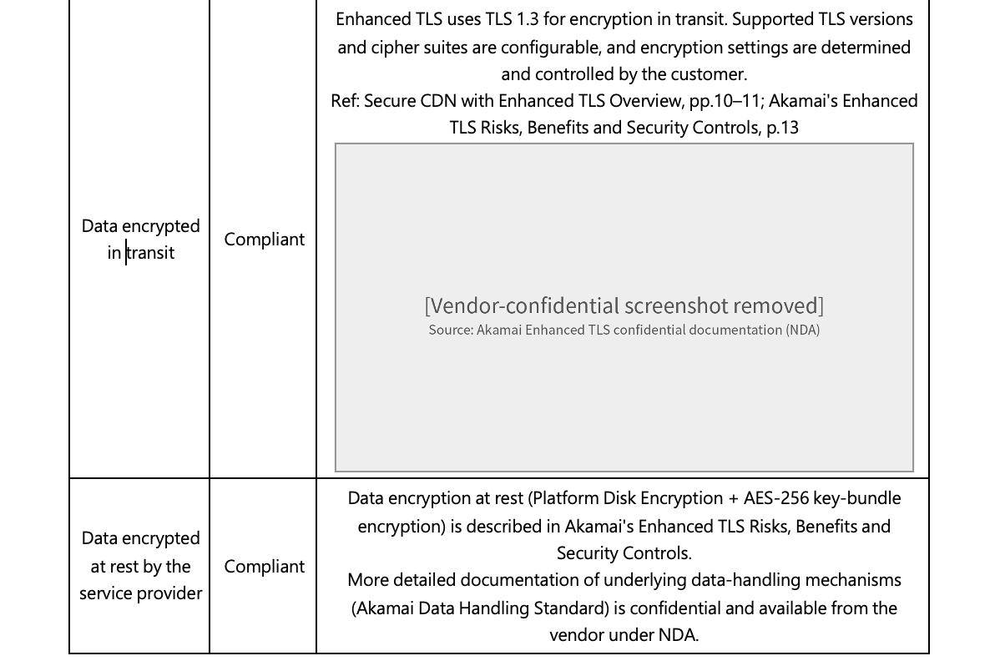
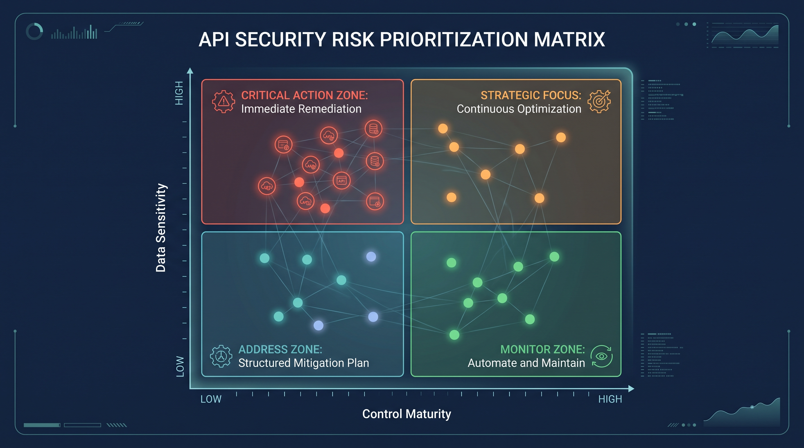

## English

### Solution Mindset
Centrally stored data is not equivalent to comparable or decision-ready information. Forcing project notes, vendor responses, technical requirements, and test statuses that lack a common standard into a single table often just creates "more organized chaos."

I first extract common dimensions that hold alignment value—such as bottlenecks, ownership, success criteria, and next actions. I then map these indicators back to the actual operational context for layered convergence, allowing the data to substantively support executive decision-making.

### Field Cases

#### 01. POC Execution Tracking and Process Optimization
Previously, execution statuses and blocking reasons for various POCs were extremely fragmented, making it difficult for management to identify systemic bottlenecks faced by the delivery team. I structured these scattered POC execution records into a transparent quarterly view, clearly presenting progress, blockers, and follow-up conditions. The goal wasn't assigning blame; as a frontline operator, my objective was to provide management and the delivery team with an objective basis for optimizing workflows, ensuring support resources were allocated accurately.

#### 02. Financial Sector Composite Threats and API Governance Prioritization
During an API Security assessment project in the financial sector, the client sought governance solutions to meet strict industry regulations. However, the technical requirements gathered by the team were difficult to translate into business language and compliance-driven value for decision-makers. I first extracted common dimensions, using the OWASP Top 10 API framework to inventory and converge data on API visibility and control gaps. Next, I deeply aligned these technical indicators with financial regulatory rationale (mapping them item by item), translating them into a clear defense prioritization that successfully drove the remediation plan at the governance level.

#### Supporting artifact: Vendor documentation boundary

The public artifact records the decision boundary: only documentation that can be safely summarized is used, while vendor-confidential source material remains excluded.

*De-identified supporting artifacts. Client names, identifiers, and confidential configuration details have been removed.*

#### 03. Large-Scale Technical Selection Decision Materials
During large-scale technical selection processes, key evaluation criteria and items pending confirmation are often scattered across countless emails and meeting minutes. This leads to a lack of concrete verification basis before the final procurement decision, making it impossible to pinpoint "what the user actually wants." Putting myself in the client's shoes, I helped the team transform these divergent requirements into evidence checklists, testing assumptions, and delivery checkpoints understandable to the buyer. This ensured that before the executive level gave final approval, all expected outcomes could be accurately checked and verified.

## 中文

### 解決方案思維
集中保存的資料，並不等同於可比較或可供決策的依據。若只是將缺乏共通標準的專案紀錄、供應商回覆、技術需求與測試狀態強行拼湊，往往只會得到「更整齊的混亂」。

我會先萃取具備對齊價值的共通維度（如：瓶頸點、責任歸屬、成功標準與下一步），再將這些指標連回實際的營運情境中進行分層收斂，讓資料能實質支援決策。

### 實務案例

#### 01. POC 執行追蹤與流程優化
過去不同 POC 的執行狀態與卡關原因極度零散，導致管理層難以辨識交付團隊面臨的系統性瓶頸。我將這些零散的 POC 執行紀錄結構化為透明的季度視圖，清晰呈現進度、阻塞點與後續條件。目的並非咎責，而是因為我是第一線人員，旨在為管理層與交付團隊提供優化工作流程的客觀依據，讓支援資源能精準投入。

#### 02. 金融業複合型威脅與 API 治理優先級
在一次金融業的 API Security 評估專案中，客戶因金融業相關法規針對 API 治理問題而尋求治理相關解決方案。然而，當時團隊收集到的技術需求難以轉化為商業語言與法規導向將價值傳遞給決策者，我首先萃取具備對齊價值的共通維度，將以 Owasp Top 10 API 框架為原則，盤點出來的 API 可視性與控制缺口數據進行分層收斂。接著，我將這些技術指標與金融監理法遵要求 (Regulatory Rationale) 深度對齊，逐條核對，轉化為一目了然的防禦優先順序，驅動了並推進治理層面的修補計畫。

#### 03. 大型技術評選決策材料
在大型技術評選過程中，關鍵的評估標準與待確認項目常散落於無數的信件與會議紀錄中，導致最終採購決策前缺乏具體的查核依據且無法準確定位「使用者究竟要什麼？」。我協助團隊將這些發散的需求已換位思考的角度，轉化為甲方可理解的佐證清單、測試假設與交付檢查點。這確保了在決策層拍板前，所有的預期結果都能被精準核對與驗證。

*去識別化佐證圖；已移除客戶名稱、識別資訊與機密設定細節。*
