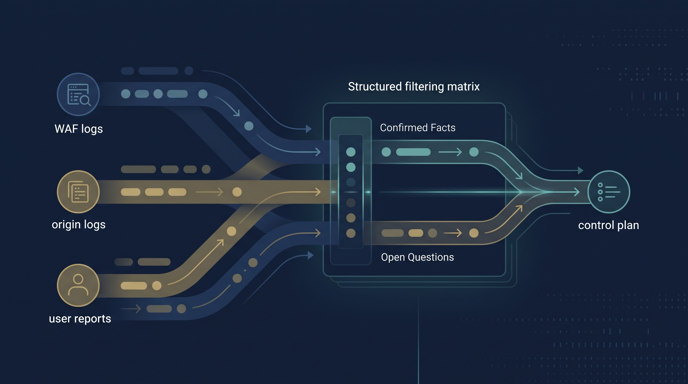
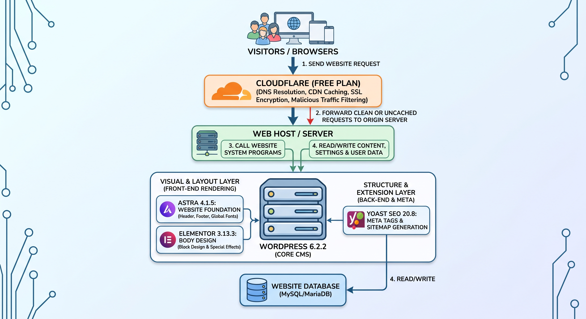

## English

### Practical Starting Point
Before formally entering the cybersecurity field, I served as the primary digital operator for a family e-commerce brand, responsible for building and maintaining the website, product information, copywriting, visual assets, and daily operations. This experience profoundly taught me that Confidentiality, Integrity, and Availability (CIA) are not abstract concepts, but highly concrete cornerstones of business operations.

### Internalized Security Awareness Principles
Although not a formal cybersecurity role, this position made data boundaries, information accuracy, service continuity, and change discipline my daily practical responsibilities. This experience of directly facing operational pressure became a crucial foundation for my subsequent handling of architecture controls, risk assessments, and handoff processes in the security sector.

#### 01. Confidentiality: Strictly Controlling Data Processing Boundaries
In small-scale operational contexts, customer and order data can easily leak or scatter just for temporary workflow convenience. I established a maintainable information structure from the source, strictly controlling the processing boundaries of order data to prevent sensitive data leakage driven by convenience, thereby establishing a privacy baseline for daily operations.

#### 02. Integrity: Maintaining Consistent External Communication
When product information, pricing, and visual content lack a unified update source, information inconsistencies easily arise, directly damaging customer trust and operational judgment. I ensured that all changes to product pricing and visual content were traceable, maintaining the absolute integrity and accuracy of external communication materials.

#### 03. Availability: Sustaining the Business Lifeline
Any incorrect content update or configuration could paralyze the transaction portal, directly halting revenue. I deeply realized that as the operational entry point for customers to interact with the brand, a website's availability impacts the entire business lifeline, not just IT infrastructure. Consequently, I introduced rigorous change discipline to ensure the service could continue to operate stably.

## 中文

### 實務起點
在正式踏入資安領域前，我曾在家族電商擔任主要數位營運角色，負責建立與維護網站、商品資訊、文案、視覺素材與日常營運。這段經歷讓我深刻體會，機密性 (Confidentiality)、完整性 (Integrity) 與可用性 (Availability) 絕非抽象概念，而是極為具體的營運基石。

### 內化的安全意識原則
這雖非正式的資安職務，卻讓資料邊界、資訊正確性、服務連續性與變更紀律成為我日常的實務責任。這段直接面對營運壓力的經歷，成為我日後在資安領域處理架構控制、風險評估與交接流程時的重要根基。

#### 01. 機密性 (Confidentiality)：嚴控資料處理邊界
在小型營運情境裡，只要為了一時的作業方便，客戶與訂單資料極易外流散落。我從源頭建立可維護的資訊結構，嚴格控管訂單資料的處理邊界，避免因追求便利而導致敏感資料外洩，確立了日常營運的隱私底線。

#### 02. 完整性 (Integrity)：維持對外溝通一致性
當商品資訊、價格與視覺內容缺乏統一的更新來源時，極易產生資訊不一致，直接折損客戶信任與營運判斷。我確保所有商品價格與視覺內容的變更都具備可追溯性，維持了對外溝通材料的絕對完整與正確。

#### 03. 可用性 (Availability)：維繫商業命脈
任何錯誤的內容更新或設定，都可能導致交易入口停擺，直接中斷營收。我深刻體認到網站身為客戶接觸品牌與完成交易的入口，其可用性影響的是整體商業命脈，而不單單只是 IT 技術問題。因此，我導入了嚴謹的變更紀律，確保服務能持續穩定運作。

